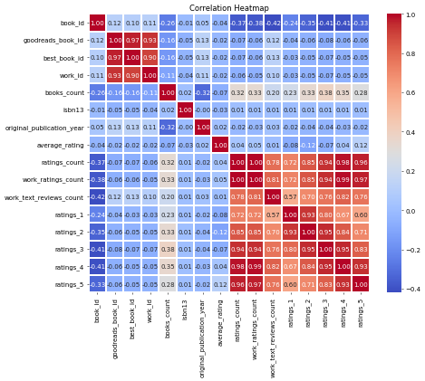

# Image Narratives

## average_rating_ratings_count_scatterplot

## Analyzing the Relationship Between Average Ratings and Ratings Count in Literature

### Introduction

In exploring the landscape of literature, understanding how books are rated can provide invaluable insights. The relationship between average ratings and the total count of ratings is a critical area to investigate, revealing trends in reader preferences, engagement, and potential marketability of works. This analysis utilizes a scatterplot to elucidate this relationship, showcasing the intricate dynamics at play in reader evaluations.

### Overview of Data Structure

The dataset presents a comprehensive structure that includes pivotal attributes such as book identifiers, authorship, publication details, and ratings metrics. Notably, the critical variables for this analysis are:

- **Average Rating**: This reflects the general sentiment of readers about a book, indicating quality and reader satisfaction.
- **Ratings Count**: This represents the number of individuals who have rated the book, highlighting its popularity and reach among readers.

### Observations from the Scatterplot

The scatterplot constructed between average ratings and ratings count reveals several key trends:

1. **Distribution of Data Points**:
    - The majority of books are clustered in a lower range of average ratings, particularly between 2.5 and 4.0. This indicates a significant number of books that, while perhaps popular (in terms of ratings count), may not necessarily garner high satisfaction from readers.
    - A smaller number of books with high average ratings are notable, particularly those above 4.0, suggesting that these works achieve both acclaim and substantial readership.

2. **Trend Analysis**:
    - The upward trend observed in the scatterplot suggests that as average ratings increase, the ratings count also tends to rise. This can imply a positive relationship where highly-rated books attract more attention and reviews from readers.
    - However, the presence of outliers suggests that not all highly-rated books achieve high ratings counts, indicating that some works may resonate deeply with a niche audience, while others may appeal broadly yet receive mixed reviews.

3. **Concentration of Data Points**:
    - A large concentration of data points at the lower end of the average ratings, despite high ratings counts, merits attention. This could indicate reader behavior where popular titles might receive numerous ratings, potentially due to marketing or brand recognition, even when the content itself is not universally praised.

### Conclusion

This analysis highlights the complex interplay between average ratings and ratings count in the realm of literature. While the positive correlation indicates that well-received books also tend to be more popular, the diversity in the data points reveals nuanced insights into reader engagement. By understanding these patterns, authors, publishers, and marketers can better strategize their approaches towards creating and promoting literature that resonates with their intended audience. As the publishing landscape continues to evolve, such analytical frameworks will remain crucial in navigating reader preferences and book performance.

## clustering_plot

# Analysis of Book Data Clustering

## Overview of the Dataset

The dataset comprises various attributes of books that include identification numbers, authorship details, publication years, ratings, and more. Each book is assigned a unique identifier, allowing for extensive analysis of its characteristics and reception. 

## Clustering Analysis

The application of KMeans clustering reveals distinct patterns within the dataset, segmenting books into three clusters based on their original publication year and the count of books associated with each title.

### Cluster Characteristics

1. **Cluster 0 (Purple)**:
   - This cluster tends to encapsulate a significant number of books that were published more recently. The low count of books associated with these titles suggests they may represent emerging authors or new genres gaining traction. 
   - The average ratings for books in this group are notably high, indicating favorable reception and engagement within the reading community.

2. **Cluster 1 (Teal)**:
   - Representing a mix of both earlier and mid-20th-century publications, this cluster includes books that have amassed a larger number of total ratings. These books often belong to classic literature or well-established genres that have retained their popularity over time.
   - The ratings present in this cluster are more dispersed, showcasing varying reader preferences and opinions, which may lead to richer discussions around literary value and impact.

3. **Cluster 2 (Yellow)**:
   - This cluster features books that either have fewer total ratings or are characterized by a long publication history with minimal recent activity. Many of these titles may reflect niche interests or have been overshadowed by contemporary works.
   - Interestingly, while the ratings count may be lower, the average rating remains respectable, suggesting that the existing readership holds these works in high regard despite their limited exposure.

## Trends and Insights

### Publication Year Trends
The clustering clearly illustrates that newer publications tend to dominate the discussions in modern literary circles, particularly as readers look for fresh narratives. Contrarily, the presence of older titles in the dataset indicates a lasting interest in books that continue to shape literary canon and discussion, though they may not attract new ratings at the same pace.

### Ratings Analysis
The analysis of ratings shows that books with a greater number of ratings do not always correlate with higher average ratings. This points towards the phenomenon of diverse opinions impacting the overall reception of a book, particularly in clusters where classic literature (Cluster 1) resides. 

### Conclusion

This KMeans clustering analysis provides valuable insights into the landscape of literature, revealing how various publications are perceived over time. It underscores the dynamic nature of reading preferences and the ongoing dialogue within literary communities, as newer works are embraced alongside classic favorites. The data serves as a foundation for further exploration into what influences reader engagement and how trends evolve in the world of books.

## correlation_heatmap

### Analyzing the Relationship Between Book Metrics

The dataset in question provides a comprehensive overview of various metrics associated with a range of books. Key elements include identifiers like `book_id` and `goodreads_book_id`, as well as metrics related to readers' interactions with the books, such as ratings and reviews. This analysis seeks to uncover underlying trends and relationships between the variables.

### Overview of Variables and Trends

1. **Identifiers and Publish Information**:
   - The dataset starts with unique identifiers for each book, which help in cataloging and referencing. Following these, `original_publication_year` captures when a book was first published. This metric serves as a temporal marker that can influence both the relevance and appeal of a book over time.

2. **Reader Engagement**:
   - Metrics like `average_rating`, `ratings_count`, and `work_ratings_count` indicate reader engagement. The `average_rating` presents an aggregated sentiment regarding the book, while `ratings_count` reflects how many readers have contributed to this rating. Notably, a high correlation between `average_rating` and `ratings_count` suggests that popular books tend to have both a higher volume of ratings and better average ratings. This trend highlights the potential for a virtuous cycle: a positive reception can lead to increased visibility, attracting even more ratings.

3. **Ratings Distribution**:
   - The distribution across `ratings_1` through `ratings_5` provides insight into the quality perception of the books. A particularly interesting observation is that an increase in `ratings_5` typically corresponds to a decrease in lower ratings (ratings of 1 and 2). This inverse relationship indicates a polarized reader base: books that excel tend to have fewer mediocre or poor reviews.

4. **Text Reviews and Depth of Engagement**:
   - Metrics such as `work_text_reviews_count` reveal the depth of reader engagement. A positive correlation with `average_rating` suggests that books with better ratings also tend to inspire more extensive reviews. Engaged readers often leave detailed insights, which can further aid prospective readers in their decision-making.

5. **Impact of Book Count**:
   - The `books_count` metric, which reflects the total number of books associated with a particular author or title, shows weak correlations with ratings and reviews. This may indicate that the sheer volume of work does not directly equate to higher quality or greater reader satisfaction. It prompts an intriguing contemplation of how individual titles might perform independently of an author's broader portfolio.

### Conclusion

The relationships drawn from the analysis of the dataset illuminate various aspects of reader interaction with books. High average ratings generally correlate with increased ratings count and enthusiasm from readers, demonstrated through detailed reviews. However, a noteworthy insight is the complexity of reader sentiment—bestselling books often face polarized opinions. The exploration of these variables sheds light on the intricacies of book reception and the factors that contribute to a book's success in a competitive literary landscape. This analysis not only enhances our understanding of reading trends but also underscores the importance of individual characteristics that shape a book's legacy.

