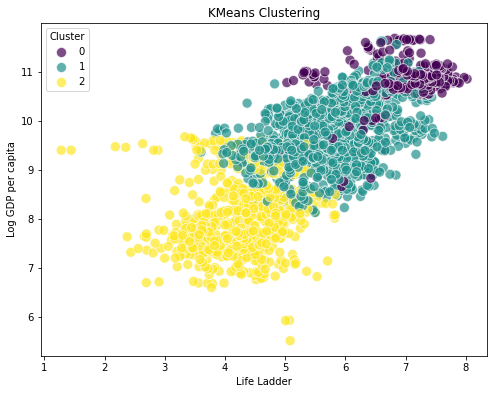
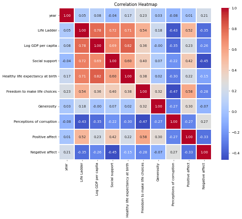
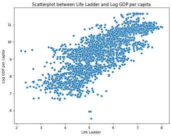

# Image Narratives

## clustering_plot

### The Life Ladder and Well-Being Across Nations

In an increasingly interconnected world, the pursuit of happiness and well-being takes center stage in discussions surrounding quality of life. By analyzing various nations through multiple dimensions, key insights emerge regarding the relationship between economic factors, social support, and overall life satisfaction. This exploration utilizes KMeans clustering to categorize countries based on two significant metrics: the Life Ladder score and Log GDP per capita.

### The Life Ladder: A Measure of Happiness

The Life Ladder represents a subjective measure of well-being, reflecting how individuals perceive their quality of life. Countries mostly cluster into three distinct groups, illustrating diverse experiences and happiness levels.

1. **High Satisfaction and Economic Prosperity (Cluster 0)**:
   This cluster predominantly features countries with a high Life Ladder score and high Log GDP per capita. Individuals in these nations report substantial satisfaction with their lives, aided by robust economic frameworks that promote adequate living standards. The correlation is clear: higher income often translates to better life satisfaction. Countries in this category benefit from systematic social support and healthcare systems, thereby fostering a positive outlook among citizens.

2. **Moderate Life Satisfaction (Cluster 1)**:
   The second cluster encompasses nations where citizens experience moderate happiness paired with moderate economic output. These countries reveal a more nuanced relationship between GDP and life satisfaction. While economic conditions are favorable, social support systems may not be as developed, leading to varied experiences among the populace. Feelings of freedom to make life choices and perceptions of corruption also influence this cluster significantly, shaping individual perspectives on overall well-being.

3. **Challenges in Happiness (Cluster 2)**:
   Finally, countries in this cluster represent lower Life Ladder scores along with lower Log GDP per capita. Individuals here frequently face economic challenges that hinder their overall satisfaction. Although there might be potential for decent social connections and a sense of community, the lack of economic stability contributes to feelings of despair. Inadequate health infrastructure and perceptions of corruption are prevalent, emphasizing the role of systemic issues in hindering personal and collective happiness.

### Social Support and Its Impact

Across all clusters, the role of social support emerges as a crucial influencer of happiness. Those with robust networks and community support systems report higher scores on the Life Ladder, reflecting the importance of relationships and communal ties in fostering well-being. Even in countries with lower economic outputs, strong social connections can ameliorate some of the negative impacts associated with poverty and insecurity.

### Health and Life Expectancy

The aspect of healthy life expectancy serves as another integral measure in understanding well-being. Countries with strong healthcare systems and policies tend to reflect better outcomes in both Life Ladder scores and perceptions of life quality. As health directly affects an individual’s ability to engage in social activities and contribute to society, it remains a vital pillar of happiness in any nation’s overall assessment.

### Freedom to Make Choices and Generosity

Not to be overlooked, the dimensions of freedom and generosity significantly influence perceptions of happiness. Countries that promote individual freedom tend to cultivate environments conducive to higher life satisfaction. Simultaneously, a culture of generosity fosters a sense of community and shared responsibility, enhancing feelings of trust and belonging, which are essential for higher Life Ladder scores.

### Corruption as a Deterrent

Lastly, perceived corruption in government and institutions emerges as a deterrent to happiness. Countries with high levels of corruption experience diminished trust in leadership and systems, leading to a pervasive sense of disenchantment among the population. Thus, addressing corruption is essential for fostering a sense of security and contributing positively to the Life Ladder scores of a nation.

### Conclusion

Through the lens of KMeans clustering, the interconnectedness of wealth, well-being, and social factors becomes clear. The analysis provides a roadmap for understanding how nations can prioritize policies that enhance life satisfaction, focusing on economic stability, social support, health, and fostering environments of freedom and generosity. As countries navigate the complexities of modern life, the collective goal remains the same: to elevate the Life Ladder for all citizens, creating a more fulfilling existence on both individual and communal levels.

## correlation_heatmap

# Analyzing Global Well-Being: Insights from Correlation Trends

In a comprehensive exploration of global well-being indicators, various dimensions of quality of life are interwoven. By examining the relationships between these indicators, we can uncover intricate patterns that contribute to the overall happiness and satisfaction experienced by individuals across different countries.

## The Life Ladder and Economic Indicators

The "Life Ladder," a subjective measure of overall life satisfaction, demonstrates a notable positive correlation with "Log GDP per capita" at 0.78. This suggests that as economic conditions improve, individuals tend to report higher satisfaction in their lives. The significance of economic prosperity is further highlighted by its connection to "Healthy life expectancy at birth" (0.71). A robust economy not only enhances material conditions but also contributes to better health outcomes, reinforcing the adage that financial well-being is closely intertwined with quality of life.

## Social Support as a Cornerstone

"Social support" emerges as a crucial factor with a commendable correlation coefficient of 0.58 when aligned with the Life Ladder. This reflects the vital role of social networks and robust community ties in fostering individual happiness. Individuals with strong social ties often report higher satisfaction, emphasizing that interpersonal relationships can provide emotional resilience and contribute significantly to overall well-being.

## The Role of Autonomy and Generosity

The indicators relating to "Freedom to make life choices" (0.57) and "Generosity" (0.32) also show a positive link with life satisfaction. These findings indicate that personal agency and the ability to act in alignment with one’s values enhance well-being. Moreover, the act of giving and engaging with others positively is linked to greater life satisfaction, suggesting that generosity not only benefits recipients but also enriches the giver's sense of purpose.

## Perceptions of Corruption and Affect

Examining well-being further reveals interesting dynamics surrounding perceptions of corruption. With a negative correlation to the Life Ladder of -0.68, a country’s perceived corruption significantly detracts from citizens' overall happiness. This trend underscores that trust in institutions is paramount; where corruption is prevalent, satisfaction typically diminishes.

Additionally, emotional dimensions such as "Positive affect" (0.46) and "Negative affect" (-0.38) reveal the complexity of emotional experiences tied to life satisfaction. Higher positive emotional experiences correlate positively with life satisfaction, while negative feelings inversely affect it. This interplay between different emotional states echoes the idea that cultivation of positive experiences can lead to richer life satisfaction.

## Conclusion: Toward Holistic Approaches

The interdependencies of these well-being indicators can guide policymakers and social planners in fostering environments that enhance life satisfaction. Recognizing the interconnectedness of economic prosperity, social support, individual freedoms, and emotional health can lead to more holistic approaches to planning and intervention. By prioritizing these dimensions, societies can aim to elevate overall well-being, ensuring a brighter future for their citizens.

## LifeLadder_LogGDPpercapita_scatterplot

### Exploration of Well-Being Across Countries

#### Overview

In the quest to understand the factors influencing well-being across nations, a detailed analysis has been conducted using a variety of metrics. This exploration focuses on the relationship between the Life Ladder, which serves as a subjective measure of overall life satisfaction, and Log GDP per capita, reflecting economic prosperity. Various additional parameters such as social support, healthy life expectancy, freedom to make life choices, generosity, perceptions of corruption, positive affect, and negative affect further enrich the analysis, providing insights into the complex drivers of human well-being.

#### Relationship Between Life Satisfaction and Economic Prosperity

A fundamental observation emerges when examining the scatterplot that depicts the relationship between Life Ladder scores and Log GDP per capita. The data suggests a clear positive correlation; countries that exhibit higher GDP per capita tend to report greater life satisfaction. As GDP rises, individuals typically experience improved access to resources, services, and opportunities, contributing to their overall sense of well-being.

#### Social Support and Its Crucial Role

Delving deeper into the contributors to life satisfaction, social support emerges as a critical determinant. Countries with stronger social networks and community ties tend to report higher Life Ladder scores. The perception of having someone to rely on in times of need can significantly enhance an individual’s overall happiness and contentment. This metric emphasizes the importance of community and support systems in fostering a sense of security and belonging, which are vital components of well-being.

#### Healthy Life Expectancy

Another noteworthy metric is healthy life expectancy at birth. The data indicates that countries with higher healthy life expectancy also rank favorably on the Life Ladder. This correlation underscores the significance of not only living longer but living healthier lives, as physical well-being plays a crucial role in overall life satisfaction. Health services and public health initiatives contribute significantly to this metric, suggesting that investments in healthcare can yield substantial returns in quality of life.

#### Freedom to Make Life Choices

Moreover, the autonomy individuals feel regarding their life choices is a strong predictor of well-being. Countries that empower their citizens with more freedom and opportunities to make personal decisions tend to rank higher on the Life Ladder. This factor reflects the intrinsic desire for agency and control over one’s own life, which is essential for mental and emotional well-being.

#### Generosity and Its Impact on Happiness

Intriguingly, the data also highlights the role of generosity. Nations where citizens engage in altruistic behaviors and show high levels of giving tend to exhibit higher life satisfaction. This finding suggests that the act of giving and contributing to the welfare of others can lead to enhanced feelings of happiness and fulfillment. Such behaviors foster not only community cohesion but also personal gratification, creating a virtuous cycle of well-being.

#### Perceptions of Corruption

Conversely, the perceptions of corruption within a country can detrimentally affect life satisfaction. Countries with higher perceived corruption levels tend to report lower rankings on the Life Ladder. This negative sentiment can erode trust in institutions and social systems, leading to feelings of disenfranchisement among citizens. The data implies that transparency and governance play pivotal roles in enhancing the overall well-being of the populace.

#### Positive and Negative Affects

Finally, positive and negative affect ratings, which capture emotional responses to daily life, offer additional insight into well-being. A higher prevalence of positive affect is closely associated with higher Life Ladder scores, while increased negative affect correlates with lower satisfaction levels. This emotional landscape illustrates that daily experiences significantly impact overall life evaluations, highlighting the importance of fostering positive environments and reducing stressors.

#### Conclusion

The analysis underscores the multidimensional nature of well-being. Factors such as economic prosperity, social support, health, freedom, generosity, corruption perceptions, and emotional experiences interact in intricate ways to shape life satisfaction across countries. This exploration lays the groundwork for policymakers and stakeholders to focus on holistic strategies that enhance not only economic conditions but also social, health, and emotional dimensions of life, ultimately fostering a more fulfilling existence for individuals around the globe.

