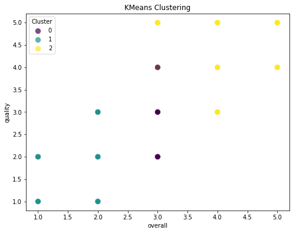
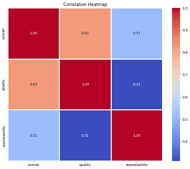
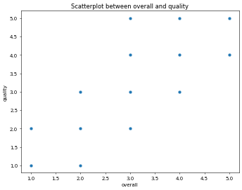

# Image Narratives

## clustering_plot

**Exploring the Dynamics of Quality and Overall Ratings through KMeans Clustering**

In the realm of data analysis, understanding relationships between different quality metrics and overall ratings can significantly enhance decision-making processes. Using KMeans clustering, we can unveil the underlying patterns within the dataset, highlighting distinct groups that express varying degrees of quality and overall satisfaction.

**Understanding the Data Structure**

The dataset is designed to elucidate the connections between perceived quality and overall ratings assigned to various entries. Each entry displays a quality score that reflects its measured performance dimensions, while the overall rating encapsulates a subjective evaluation based on multiple criteria.

**Clustering Insights**

The KMeans clustering algorithm reveals three distinct clusters within the dataset, each signifying a unique relationship between overall ratings and quality scores:

1. **Cluster 0:** This cluster represents entries with low overall ratings (ranging from 1 to 2) and correspondingly low quality scores. It illustrates a segment of the dataset that may be underperforming, characterized by dissatisfaction or minimal engagement from evaluators.

2. **Cluster 1:** The values in this cluster predominantly occupy the middle ground, showcasing moderate overall ratings (approximately 2.5 to 3.5) and varying quality scores. This indicates a diverse group of entries that may deliver acceptable performance but lack the exceptional qualities that drive higher satisfaction levels.

3. **Cluster 2:** Distinguished by high overall ratings (4 to 5), this cluster signifies entries that consistently score high on quality as well. It represents a cohort of exemplary performances, characterized by positive user experiences and high levels of satisfaction.

**Quality Versus Overall Ratings: Trends and Observations**

The chart displays intriguing trends between quality and overall ratings, emphasizing the correlation between these two aspects. Entries within Cluster 2 not only achieve high overall ratings but also maintain superior quality scores, suggesting that enhancements in quality have a direct impact on user satisfaction.

Conversely, entries in Cluster 0 highlight a critical area for improvement. The evident gap between this cluster and its higher-rated counterparts indicates the necessity for evaluating the factors leading to low satisfaction and quality perceptions. Understanding these dynamics can guide strategic initiatives aimed at enhancing performance.

**Strategic Implications of Clustering Analysis**

Identifying these clusters offers valuable insights for stakeholders. Focusing on elevating entries in Cluster 0 could involve analyzing user feedback to pinpoint precisely what contributes to their low ratings. Conversely, examining the successful strategies implemented in Cluster 2 can foster techniques that might be adapted for lower-performing entries.

Overall, the application of KMeans clustering not only facilitates an understanding of quality and satisfaction dynamics but also lays the groundwork for informed enhancements in product features, customer service, and engagement strategies. Harnessing these insights can drive initiatives that promote higher overall satisfaction, ultimately leading to improved business outcomes.

## correlation_heatmap

### Data Analysis Report

#### Introduction
In analyzing the interrelationships between key metrics—overall performance, quality, and repeatability—we employ a correlation heatmap that visually represents the strength and direction of these connections. This analysis helps to uncover insights that can guide future enhancements in processes, product improvements, and strategic decision-making.

#### Overview of Metrics
The three primary metrics explored in this analysis are:

- **Overall Performance**: This metric assesses the general efficacy of a system or process.
- **Quality**: This evaluates the standard of output, including parameters such as accuracy and reliability.
- **Repeatability**: This reflects the ability to achieve consistent results when the same conditions are applied.

#### Correlation Insights
The correlation values range from -1 to 1, where values near 1 indicate a strong positive correlation, values near -1 suggest a strong negative correlation, and values around 0 imply no correlation.

- **Overall Performance and Quality**:
  A high correlation of 0.83 suggests a robust relationship between overall performance and quality. This indicates that improvements in quality typically lead to enhanced overall performance. It emphasizes the importance of maintaining high-quality standards to ensure system effectiveness.

- **Overall Performance and Repeatability**:
  The correlation between overall performance and repeatability is moderate, with a value of 0.51. This suggests that while there is a positive relationship, it is not as strong as that with quality. This finding prompts the need for additional focus on enhancing repeatability to ensure that high overall performance can be consistently achieved.

- **Quality and Repeatability**:
  The correlation of 0.31 between quality and repeatability is relatively weak. This indicates that while there may be a connection, efforts to improve quality do not necessarily guarantee improvements in repeatability. Consequently, tackling these two metrics may require distinct strategies to foster progress.

#### Conclusion
The analysis of the correlation heatmap highlights the intricate relationships between overall performance, quality, and repeatability. The strong correlation between overall performance and quality emphasizes a clear directive for organizations to prioritize quality enhancement initiatives. Meanwhile, the moderate and weak correlations urge a tailored approach; improving repeatability may not directly influence quality, signaling a potential area for further strategic development. 

By understanding these relationships, organizations can allocate resources more effectively, ensuring that each metric is treated with the appropriate level of attention, ultimately leading to improved outcomes and efficiency.

## overall_quality_scatterplot

### Exploring Trends in Overall Ratings and Quality

In the pursuit of understanding how overall perceptions and quality assessments interact, we delve into an intriguing dataset characterized by specific numerical ratings. This dataset, summarized visually in a scatterplot, reveals connections between overall ratings and the perceived quality of various items. Each point in this visualization signifies a unique assessment, allowing us to extract meaningful trends that warrant thorough exploration.

### Overall Rating Distribution

The overall ratings are organized on a scale from 1 to 5, providing a broad spectrum for evaluating various facets of the items under consideration. This spectrum allows for an appreciation of how users perceive the general worth of each item. An examination of the points on the scatterplot suggests a clustering around mid-range ratings (2 to 4). Notably, very high ratings (4 to 5) are less frequently observed, indicating a potential ceiling effect that may restrict higher overall impressions.

### Quality Assessment Analysis

Similar to the overall ratings, the quality measure also extends from 1 to 5. The scatterplot demonstrates a notable distribution, with certain points clustering closely together. Interestingly, the quality assessment appears to mirror the general perceptions of the overall rating, suggesting a strong correlation. Items rated highly in quality, such as those that fall in the range of 4 and 5, also tend to have high overall ratings. 

Conversely, lower quality ratings exhibit a broader dispersion, indicating that while some items may receive low overall marks, there are instances where they still maintain a middle-ground position in quality assessments. This could imply that while certain items are recognized for their shortcomings, they may still have appealing characteristics that prevent them from receiving the very lowest distinctions.

### Patterns of Repeatability

As we analyze the relationship between quality and overall ratings, one notable trend emerges: the potential for repeatability in both dimensions. Items that consistently receive higher ratings in one category often reflect similar consistency in the other. For instance, those that achieve an overall rating of 4 or higher also generally display a quality score in the same vicinity. This interplay suggests a level of reliability that could be advantageous for both producers and consumers. 

However, some outliers exist where items receive disparate ratings. This suggests that factors beyond mere quality may influence overall ratings, such as context, intentions, or user expectations. Understanding these variables is pivotal in deciphering the nuanced relationships that contribute to user perception.

### Conclusion

Overall, the analysis of the scatterplot sheds light on not just the ratings themselves but the underlying dynamics that dictate these perceptions. The correlation between overall ratings and quality assessments signals a clear trend: higher quality is synonymous with better overall impressions. However, the variability observed in lower ratings introduces an element of complexity, inviting further exploration into the potential factors influencing these outcomes. What emerges is a tapestry of user experience that highlights both reliability and exploration in overall product evaluations. This insight serves as a crucial foundation for ongoing analysis and application in future endeavors, aiming to enhance understanding of consumer behavior and preferences.

